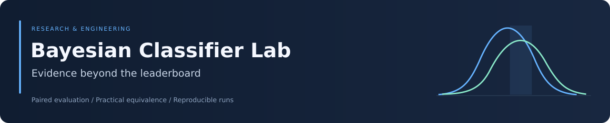
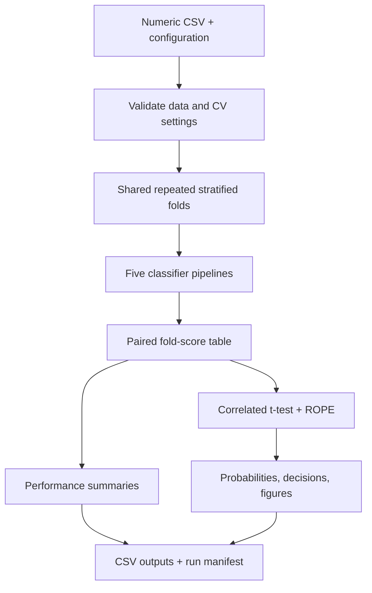

<div align="center">



# Bayesian Classifier Lab

### Statistical evidence for meaningful model comparison

[](https://github.com/Foysal-A-Al/Bayesian-Classifier-Lab/actions/workflows/ci.yml)
[](https://github.com/Foysal-A-Al/Bayesian-Classifier-Lab/actions/workflows/docker-demo.yml)


[Overview](#overview) · [Methods](#statistical-methods) · [Quick start](#quick-start) · [Results](#results-and-interpretation) · [Validation](#validation-and-reproducibility)

</div>

## Overview

Bayesian Classifier Lab is a reproducible Python framework for comparing five machine-learning classifier families using paired repeated cross-validation, a Bayesian correlated t-test, and a Region of Practical Equivalence (ROPE).

The central question is whether a performance difference is **practically meaningful and supported by evidence**. The framework retains individual fold scores, estimates posterior probabilities of superiority and equivalence, and explicitly reports inconclusive comparisons.

It is intended for researchers, students, and ML practitioners evaluating classification baselines on clean tabular datasets. The included synthetic dataset demonstrates the software workflow; it is not the complete thesis benchmark or evidence of clinical validity.

| Capability | Implementation |
|---|---|
| Fair baseline comparison | Identical stratified train/test indices for every classifier |
| Auditable evaluation | Fold identifiers, scores, sample counts, and timing records |
| Practical model selection | Three posterior probabilities and a configurable ROPE |
| Reproducible execution | Seeded splits, YAML configuration, and a versioned run manifest |
| Research outputs | Summary tables, decision matrices, and posterior figures |
| Portable workflow | Python CLI, Conda environment, and Docker |

## Architecture



Preprocessing for SVM and Bernoulli Naive Bayes is fitted inside the outer training fold. The Bayesian comparison verifies matching fold keys and test fractions; incomplete or nonfinite comparisons are rejected.

## Statistical methods

For each model pair, the observed difference is

$$d_i = s_{A,i} - s_{B,i}.$$

The correlated-t model uses

$$\mu\mid\mathbf d \sim t_{n-1}\!\left(\bar d,\sqrt{s_d^2\left(\frac1n+\frac{\rho}{1-\rho}\right)}\right),$$

where $n$ is the number of paired scores, $s_d^2$ is their sample variance, and $\rho$ is estimated from the test fraction. Equal ten-fold CV uses approximately $\rho=0.1$.

For higher-is-better metrics, the ROPE $[-r,r]$ defines:

| Posterior probability | Interpretation |
|---|---|
| $P(\mu<-r)$ | B is practically better |
| $P(-r\le\mu\le r)$ | The models are practically equivalent |
| $P(\mu>r)$ | A is practically better |

Loss and timing metrics reverse the superiority interpretation. The stored mean difference and credible interval always remain in raw **A minus B** units. The default accuracy ROPE, $r=0.01$, represents one percentage point; other metrics require a justified practical threshold.

The posterior is conditional on the correlated-t assumptions and correlation approximation. It does not eliminate all uncertainty associated with repeated cross-validation. See [the methodology](docs/methodology.md) for implementation details.

## Classifier baselines

| Identifier | Estimator | Default preprocessing/configuration |
|---|---|---|
| `RandomForest` | Random Forest | 500 trees, Gini criterion, seeded execution |
| `SVM` | RBF Support Vector Machine | Standard scaling; `C=1`, `gamma="scale"`, probability estimates |
| `DecisionTree` | Decision Tree | Gini criterion; seeded execution |
| `BernoulliNB` | Bernoulli Naive Bayes | Standard scaling followed by zero-threshold binarization |
| `GaussianNB` | Gaussian Naive Bayes | Gaussian feature likelihoods; default variance smoothing |

These are baseline settings, not dataset-specific tuned configurations. See the [classifier modules](src/bayesclf/classifiers) for the complete definitions.

## Quick start

**Requirements:** Python 3.10+ and an isolated Python environment. Run setup from the repository root.

```bash
git clone https://github.com/Foysal-A-Al/Bayesian-Classifier-Lab.git
cd Bayesian-Classifier-Lab
python -m venv .venv
```

| Platform | Activate the environment |
|---|---|
| Windows PowerShell | `.venv\Scripts\Activate.ps1` |
| Linux / macOS | `source .venv/bin/activate` |

```bash
python -m pip install -e ".[dev]"
python scripts/generate_example_data.py
bayesclf --config config.demo.yml
```

| Configuration | Evaluation | Model fits | Pairwise comparisons |
|---|---|---:|---:|
| `config.demo.yml` | 3 folds × 2 repeats | 30 | 10 |
| `config.example.yml` | 10 folds × 10 repeats | 500 | 10 |

The quick demo writes to `results/demo/`. Runtime depends on hardware. Dataset and output paths resolve relative to the configuration file, so an absolute `--config` path works from another directory.

<details>
<summary><strong>Conda setup</strong></summary>

```bash
conda env create -f environment.yml
conda activate bayesian-classifier-lab
python scripts/generate_example_data.py
bayesclf --config config.demo.yml
```

</details>

<details>
<summary><strong>Docker quick demo</strong></summary>

```bash
docker build -t bayesian-classifier-lab .
docker run --rm -v "${PWD}/results:/app/results" bayesian-classifier-lab bayesclf --config config.demo.yml
```

The default image command runs the longer experiment. Mounting custom data and configuration is documented in [docs/docker.md](docs/docker.md).

</details>

## Using your own dataset

Supply a CSV with one classification target and numeric predictors. Copy `config.demo.yml` and edit:

```yaml
data:
  path: data/my_dataset.csv
  target: target
  dataset_name: my_dataset
evaluation:
  n_splits: 5
  n_repeats: 3
  random_state: 42
  metric: balanced_accuracy
bayesian:
  rope: 0.01
  decision_threshold: 0.95
  credible_mass: 0.95
output:
  directory: results/my_dataset
```

```bash
bayesclf --config my-config.yml
```

The ROPE in this example is an illustration, not a universal recommendation. The loader rejects missing/infinite predictors, duplicate columns, and single-class targets. Each class must contain at least as many examples as the fold count.

**Supported metrics:** accuracy, balanced accuracy, macro precision/recall/F1, ROC AUC, log loss, training time, and prediction time. Configuration identifiers are listed in [the evaluation module](src/bayesclf/evaluation.py).

Imputation, encoding, feature selection, and tuning must remain within training folds. Use nested CV for tuning. Grouped subjects and longitudinal records require an appropriate group/time-aware splitter, which is not implemented in the default workflow.

## Results and interpretation

| Artifact | Contents |
|---|---|
| `fold_scores.csv` | Per-model, per-repeat, per-fold scores and timings |
| `performance_summary.csv` | Model-wise means and standard deviations |
| `bayesian_<metric>.csv` | Posterior probabilities, intervals, direction, and decisions |
| `bayesian_<metric>_matrix.csv` | Pairwise decision matrix |
| `posterior_plots_<metric>/` | Ten pairwise posterior figures |
| `run_manifest.json` | Configuration, package versions, input dimensions, and output counts |

| Decision | Meaning at the default 0.95 threshold |
|---|---|
| `A_practically_better` | $P(A\text{ better})\ge0.95$ |
| `B_practically_better` | $P(B\text{ better})\ge0.95$ |
| `practically_equivalent` | $P(\text{ROPE})\ge0.95$ |
| `no_decision` | No category reaches the threshold |

**Inconclusive evidence is not equivalence.** Interpret probability, effect size, practical threshold, and uncertainty together. Runtime results also depend on hardware and system load.

## Validation and reproducibility

```bash
python -m pytest -q
ruff check .
```

The maintenance verification on **1 October 2026** passed **31 tests**, the installed CLI demo, and GitHub's Python and Docker checks. Tests cover metric direction, posterior settings, invalid datasets, impossible CV settings, paired-fold integrity, CLI validation, and the complete five-classifier pipeline. CI also verifies demo output counts and probability normalization.

The badges above show current workflow status; the dated verification records a specific tested revision.

## Project documentation

| Resource | Purpose |
|---|---|
| [Methodology](docs/methodology.md) | Statistical assumptions and metric-direction semantics |
| [Docker guide](docs/docker.md) | Container execution and custom-data mounts |
| [Data guide](data/README.md) | Dataset expectations |
| [Contribution guide](CONTRIBUTING.md) | Development, verification, and contribution scope |

Developed and maintained by [Abdullah Al Foysal](https://github.com/Foysal-A-Al). Contributions addressing reproducible bugs, stronger validation, and group-aware evaluation are welcome.
